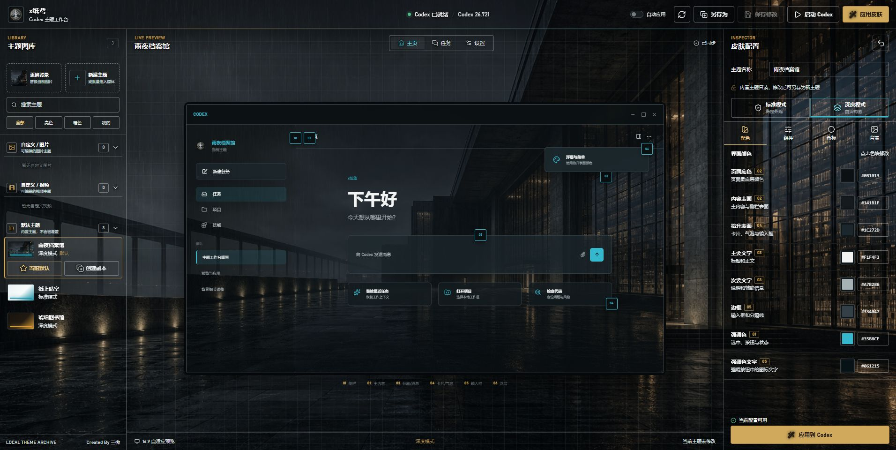
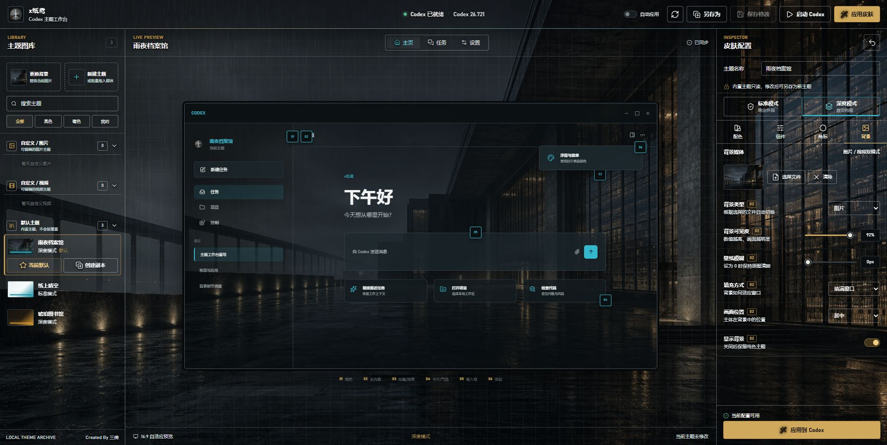
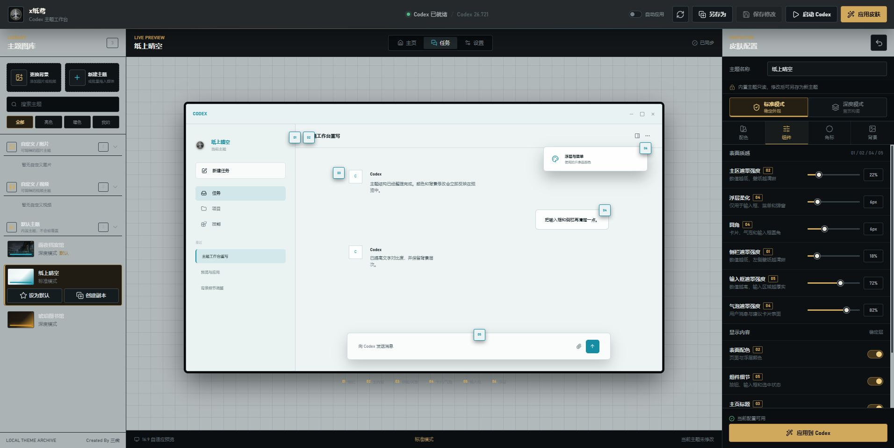

# x纸鸢

[](https://github.com/miaozyphp/xzhiyuan/releases)
[](https://github.com/miaozyphp/xzhiyuan/releases)
[](LICENSE)

x纸鸢是一款独立的 Windows Codex 主题工作台。它把图片与视频背景、配色、透明表面、组件层、左上角角标和主题管理集中在一个可视化界面里，并在应用前提供首页、任务页与设置页预览。

> 本项目是非官方社区项目，与 OpenAI 无隶属、合作或背书关系。Codex 和 OpenAI 是其各自权利人的商标。

## 立即体验

**[下载 Windows 安装版 EXE](https://github.com/miaozyphp/xzhiyuan/releases/download/v0.1.13/XZhiYuan-Setup-0.1.13-win-x64.exe)**
· [下载免安装便携包](https://github.com/miaozyphp/xzhiyuan/releases/download/v0.1.13/XZhiYuan-0.1.13-win-x64-portable.zip)
· [查看全部版本](https://github.com/miaozyphp/xzhiyuan/releases)

安装版适合直接下载体验；便携包解压后运行，适合不希望写入安装目录的用户。当前版本为未签名预览版，Windows 可能显示“未知发布者”或 SmartScreen 提示，请从本仓库下载并按 [校验说明](docs/verify-download.md) 核对 SHA-256。

## 界面预览



| 图片与视频背景配置 | 亮色主题与组件控制 |
| --- | --- |
|  |  |

## 功能介绍

| 功能 | 说明 |
| --- | --- |
| 图片与视频背景 | 支持图片、MP4/WebM/MOV 视频，提供可见度、模糊、填充方式和画面位置控制。 |
| 标准与深度模式 | 标准模式侧重稳定的背景和配色；深度模式可进一步调整 Hero、建议卡片与首页构图。 |
| 分层外观控制 | 背景、表面、组件、角标和深度布局可以分别启停，单层不兼容不会拖垮整个主题。 |
| 可视化预览 | 无需先启动 Codex，即可切换首页、任务页和设置页检查文字、输入框、气泡与浮层效果。 |
| 本地主题管理 | 支持新建、另存为、修改、复制、删除、默认主题以及自定义图片/视频分组。 |
| 拖放与批量导入 | 将一个或多个图片、视频拖入左侧主题库，即可批量创建自定义主题。 |
| 自动应用 | 可选后台代理让直接启动的 Codex 自动加载默认主题，也可随时关闭。 |
| 安全回退 | 不修改 Codex 安装包或签名；应用失败时只卸下主题，不关闭 Codex。 |

## 三步开始

1. 下载并安装 x纸鸢，打开工作台。
2. 选择内置主题，或把自己的图片、视频拖入左侧主题库。
3. 在中间预览效果，调整右侧配置，点击“应用到 Codex”。

主题和媒体只保存在本机，无需在线主题服务。工作台优先打开，Codex 检测、主题扫描和连接在后台完成。

## 工作原理与安全边界

x纸鸢通过 Chrome DevTools Protocol 向正在运行的 Codex 注入可撤销的 CSS 和 JavaScript。由工作台启动 Codex 时，会启用仅监听 `127.0.0.1` 的本地调试端口，默认端口为 `9229`。启用调试端口意味着同一台电脑上的其他进程可能连接并控制该 Codex 实例，请只在可信设备和可信账户环境中使用。

主题媒体由随机端口上的本地回环服务提供，每次运行都会生成随机访问令牌。服务只监听 `127.0.0.1`，并且只读取主题数据目录中通过路径校验的文件。

自动应用功能是可选的。启用后，x纸鸢会在当前用户的 Windows 启动项中注册后台代理；禁用功能或卸载软件会停止使用该代理。为接管未启用调试端口的 Codex，代理可能先请求正常关闭，再仅终止已确认属于目标安装位置的进程。

详细信息见 [PRIVACY.md](PRIVACY.md) 和 [SECURITY.md](SECURITY.md)。

## 数据位置

主题、设置、媒体和轮转日志默认位于：

```text
%LocalAppData%\ThemeStudioForCodex
```

`ThemeStudioForCodex` 是为了兼容现有安装而保留的内部目录和可执行文件标识，不是对外产品名称。卸载应用不会自动删除用户主题，用户可自行备份或删除该目录。

## 开发

环境要求：Windows 10 2004 或更高版本、.NET SDK `8.0.423`、Microsoft Edge WebView2 Runtime。

```powershell
dotnet restore ThemeStudio.sln --locked-mode
dotnet test ThemeStudio.sln --no-restore
dotnet run --project src/ThemeStudio.App
```

架构和主题格式分别见 [architecture.md](docs/architecture.md) 与 [theme-contract.md](docs/theme-contract.md)。参与开发前请阅读 [CONTRIBUTING.md](CONTRIBUTING.md)。

## 构建发布包

安装 Inno Setup 6 后，从仓库根目录运行：

```powershell
.\scripts\build-release.ps1
```

脚本默认读取应用项目中的版本号，也可使用 `-Version 1.2.3` 显式覆盖。它会执行依赖恢复、测试、自包含发布、安装包构建并生成 SHA-256 校验值。完整流程见 [release.md](docs/release.md)。

## 下载与验证

当前 GitHub Releases 采用未签名预览版发布。Windows 可能显示“未知发布者”或 Microsoft Defender SmartScreen 提示；项目不会提供绕过系统警告的脚本。

每个版本同时提供安装包、便携包、`SHA256SUMS.txt`、机器可读发布清单和 GitHub 构建来源证明。运行前请按照 [verify-download.md](docs/verify-download.md) 校验 SHA-256，并只从本仓库的 GitHub Releases 下载。

## 资产与主题内容

仓库内的徽标和 Image 2.0 生成素材属于 x纸鸢项目资产，并随本仓库按 MIT 许可证分发。请勿在公开主题包中提交未获授权的角色、徽章、品牌素材或二次创作内容。

## 兼容性

Codex 更新可能改变页面结构。标准模式的兼容性通常更高；深度模式依赖具体页面结构，更新后可能临时停用不兼容的单个图层。提交兼容性问题时，请附上 x纸鸢版本、Codex 版本和脱敏后的日志。

## 许可证

源代码与仓库自有资产采用 [MIT License](LICENSE)。第三方组件及其许可见 [THIRD_PARTY_NOTICES.md](THIRD_PARTY_NOTICES.md)。
